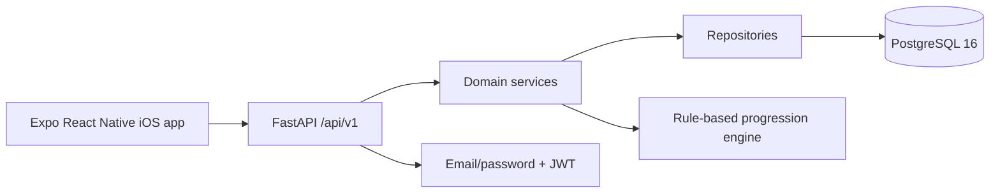

# Forge

Forge is a production-oriented mobile fitness app foundation. Milestone 1 is verified end to end across the Expo iOS app, FastAPI, and PostgreSQL. The completed scope is workout tracking: accounts, profiles, exercise library search, workout templates, active workout logging, history, previous performance, and deterministic progressive-overload recommendations.

Nutrition, AI, Apple Health, AWS deployment, social features, payments, and bodyweight analytics are intentionally out of scope for Milestone 1.

## Verified Architecture



- Mobile: React Native, Expo SDK 57, Expo Router, TypeScript, TanStack Query, Zustand persistence, React Hook Form, Zod, SecureStore token handling.
- Backend: Python 3.12, FastAPI, SQLAlchemy 2, Alembic, Pydantic v2, PostgreSQL.
- Local infrastructure: Docker Compose starts PostgreSQL and the API. The API container applies Alembic migrations, seeds global exercises, and then starts Uvicorn.
- Health checks: `/health` is a liveness endpoint; `/ready` checks database connectivity and is used by the API container healthcheck.

## Verified Feature Status

- User registration, login, JWT storage, and `/auth/me`.
- Profile onboarding and profile updates with preferred weight units.
- Seeded exercise listing and search.
- Workout template creation with ordered exercises.
- Workout session start, working-set logging, completion, and history.
- Previous performance lookup for a new workout.
- Rule-based progressive-overload recommendations.
- User data isolation across auth boundaries.
- Active workout restoration after Expo reload/reopen.

## Repository Structure

```text
forge/
├── api/
├── mobile/
├── infrastructure/
├── .github/workflows/
├── docker-compose.yml
├── .env.example
├── Makefile
└── README.md
```

## Local Environment

Create a local environment file from the safe placeholders:

```bash
cp .env.example .env
```

The example values are local-only placeholders. Do not commit `.env`, real JWT secrets, signing keys, service credentials, or native build outputs.

## Docker Startup

From the repository root:

```bash
docker compose down
docker compose up --build -d
docker compose ps
docker compose exec -T postgres pg_isready -U forge -d forge
curl -fsS http://localhost:8000/health
curl -fsS http://localhost:8000/ready
```

The API startup command inside Docker is:

```bash
alembic upgrade head &&
python -m app.db.seed &&
uvicorn app.main:app --host 0.0.0.0 --port 8000
```

## API URLs

- API base URL: `http://localhost:8000/api/v1`
- Swagger UI: `http://localhost:8000/docs`
- OpenAPI JSON: `http://localhost:8000/openapi.json`
- Liveness: `http://localhost:8000/health`
- Readiness: `http://localhost:8000/ready`

## Mobile Startup

For the iOS Simulator, use the host Mac `localhost` backend URL:

```bash
cd mobile
npm install
EXPO_PUBLIC_API_URL=http://localhost:8000/api/v1 npx expo start --clear --ios
```

The mobile API client defaults to `http://localhost:8000/api/v1`, and `EXPO_PUBLIC_API_URL` can override it.

## Verified End-to-End Workout Flow

The live iOS app was verified against the Docker FastAPI/PostgreSQL backend:

1. Register a test user.
2. Log in and retrieve the authenticated user.
3. Complete onboarding with profile preferences.
4. Browse and search seeded exercises.
5. Create a `Push Day` template containing Barbell Bench Press.
6. Start a workout from that template.
7. Log three working sets: `135 lb x 10`, `135 lb x 9`, `135 lb x 8`, all at `RPE 8`.
8. Complete the workout.
9. Confirm workout summary, history, previous bench performance, and a maintain recommendation.
10. Start another Push Day and confirm previous bench performance appears.
11. Reload the app and confirm active workout restoration preserves the in-progress workout state.

## Backend Checks

Run from `api/`:

```bash
./.venv/bin/pytest
./.venv/bin/ruff check .
./.venv/bin/mypy app
```

Current verified result:

- `pytest`: `17 passed`
- `ruff check .`: passed
- `mypy app`: passed across `44` source files

## Mobile Checks

Run from `mobile/`:

```bash
npm run test -- --runInBand
npm run lint
npm run typecheck
npx expo-doctor
npm audit --json
```

Current verified result:

- Jest: `5` suites passed, `10` tests passed
- ESLint: passed
- TypeScript: passed
- Expo Doctor: `20/20 checks passed`
- npm audit: `10` moderate advisories remain in Expo/transitive tooling (`expo`, `@expo/*`, `xcode`, `uuid`)

The npm audit fix path currently suggests changing to `expo@46.0.21`, which is a semver-major downgrade from the verified SDK 57 stack. That downgrade was not applied because it would destabilize the working mobile app and undo the verified Expo Doctor alignment.

## Known Limitations

- This milestone uses local email/password auth and a local development JWT secret. Production identity and secret management are not implemented.
- Mobile sync is request-driven; background sync, offline queueing, and conflict resolution are future work.
- Deployment infrastructure is not included in Milestone 1.
- The npm audit advisories remain until Expo upstream dependencies offer a compatible non-downgrade fix.
- Bodyweight analytics are not implemented yet.
- Nutrition, AI, Apple Health, AWS, social, and payment features remain intentionally out of scope.

## Next Milestone

Milestone 2 is bodyweight analytics: add bodyweight data capture, history, trend calculations, charts, and regression coverage without disrupting the verified workout flow.
